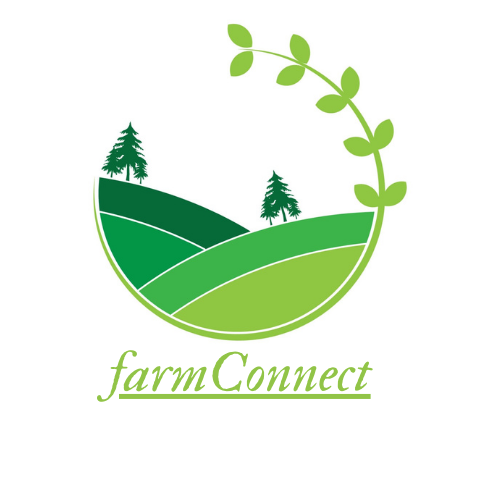

The Project we made during HackJKLU 2.0. It is a web platform that Connects farmers with consumers directly to facilitate the sale of fresh, locally grown produce that is free from middleman commission.

### Technology Stack
* HTML/CSS
* JavaScript
* Django (Python)

	
How to Setup

cmd >

	git clone https://github.com/Yarr-JKLU/Project_HackJKLU_2.0.git
	cd Project_HackJKLU_2.0/farmConnect
	pip install django mysqlclient

mysql >

    CREATE DATABASE farmConnect;
	CREATE USER 'yarr'@'localhost' IDENTIFIED BY 'yarr.GG@5000';
	GRANT ALL ON farmConnect.* TO 'yarr'@'localhost';
	FLUSH PRIVILEGES;

python >

	py manage.py makemigrations
	py manage.py migrate
	py manage.py createsuperuser

django-admin >

	Create Groups `farmers` & `consumers`.
	Create Test Users `farmer001` & `consumer001`.
	Add the Test Users to respective Groups.

